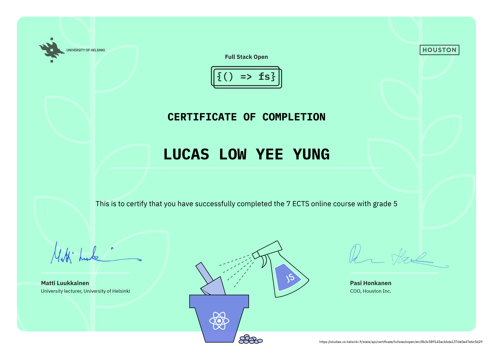

# [Full Stack Open 2022](https://fullstackopen.com/en/ "Full Stack Open 2022 Homepage")

Full Stack Web Development with modern Javascript by University of Helsinki. 

Focused solely on single web page application (SPA aka no reference). Executed with React that is RESTful on GraphQL implemented with Node.js. Part 4 and 5 includes extensive testing while the rest reiterates debugging applications, multi configrations for different modes and OS to managing different runtime environment with noSQL databases aka MongoDB.

Below is my certificate of completion and exercises to the 2022 extension of the course.

](https://studies.cs.helsinki.fi/stats/api/certificate/fullstackopen/en/8b3c589143acbbda137de0e47e6c5d29)

## Table of Contents

### Part 0: Fundamentals of Web apps

- [General info](https://fullstackopen.com/en/part0/general_info)
- [Fundamentals of Web apps](https://fullstackopen.com/en/part0/fundamentals_of_web_apps)

### Part 1: Introduction to React

- [Introduction to React](https://fullstackopen.com/en/part1/introduction_to_react)
- [Javascript](https://fullstackopen.com/en/part1/java_script)
- [Component state, event handlers](https://fullstackopen.com/en/part1/component_state_event_handlers)
- [A more complex state, debugging React apps](https://fullstackopen.com/en/part1/a_more_complex_state_debugging_react_apps)

### Part 2: Communicating with server

- [Rendering a collection, modules](https://fullstackopen.com/en/part2/rendering_a_collection_modules)
- [Forms](https://fullstackopen.com/en/part2/forms)
- [Getting data from server](https://fullstackopen.com/en/part2/getting_data_from_server)
- [Altering data in server](https://fullstackopen.com/en/part2/altering_data_in_server)
- [Adding styles to React app](https://fullstackopen.com/en/part2/adding_styles_to_react_app)

### Part 3: Programming a server with NodeJS and Express

- [Node.js and Express](https://fullstackopen.com/en/part3/node_js_and_express)
- [Deploying app to internet](https://fullstackopen.com/en/part3/deploying_app_to_internet)
- [Saving data to MongoDB](https://fullstackopen.com/en/part3/saving_data_to_mongo_db)
- [Validation and ESLint](https://fullstackopen.com/en/part3/validation_and_es_lint)

### Part 4: Testing Express servers, user administration

- [Structure of backend application, introduction to testing](https://fullstackopen.com/en/part4/structure_of_backend_application_introduction_to_testing)
- [Testing the backend](https://fullstackopen.com/en/part4/testing_the_backend)
- [User administration](https://fullstackopen.com/en/part4/user_administration)
- [Token authentication](https://fullstackopen.com/en/part4/token_authentication)

### Part 5: Testing React apps, custom hooks

- [Login in frontend](https://fullstackopen.com/en/part5/login_in_frontend)
- [props.children and proptypes](https://fullstackopen.com/en/part5/props_children_and_proptypes)
- [Testing React apps](https://fullstackopen.com/en/part5/testing_react_apps)
- [End to end -testing](https://fullstackopen.com/en/part5/end_to_end_testing)

### Part 6 - Full Stack Web Development, extension 1 (1 cr, CSM141082)
Part 6: State management with Redux

Part 7 - Full Stack Web Development, extension 2 (1 cr, CSM141083)

 Part 7: React router, custom hooks, styling app with CSS and webpack
Part 8 - Full Stack Web Development: GraphQL (1 cr, CSM14113)

 Part 8: GraphQL
Part 9 - Full Stack Web Development: TypeScript (1 cr, CSM14110)

 Part 9: TypeScript
Part 10 - Full Stack Web Development: React Native (2 cr, CSM14111)

 Part 10: React Native
Part 11 - Full Stack Web Development: Continuous Integration / Continuous Delivery (1 cr, CSM14112)

 Part 11: CI/CD
Part 12 - Full Stack Web Development: Containers (1 cr, CSM141084)

 Part 12: Containers
Part 13 - Full Stack Web Development: relational databases (1 cr, CSM14114)

 Part 13: Using relational databases
